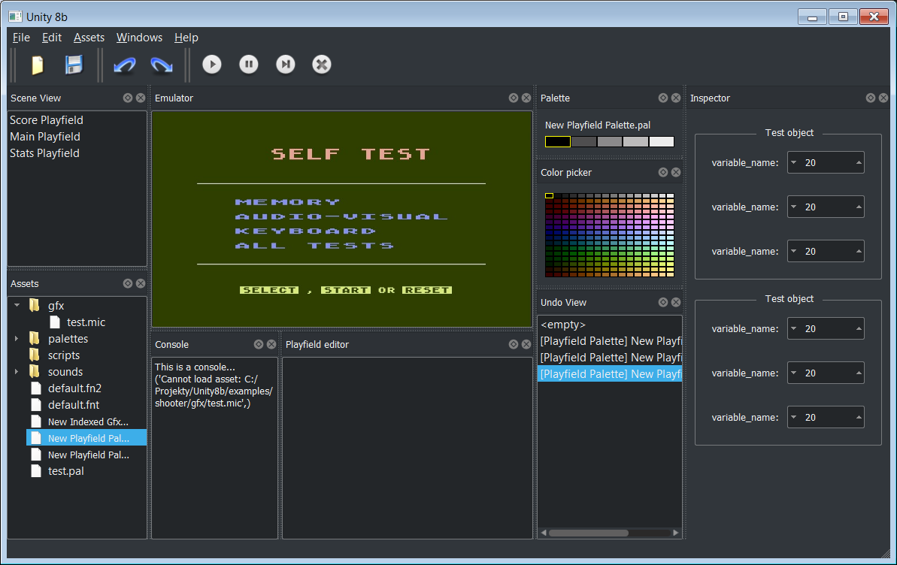

# Unity8b IDE for 8bit Atari computers

**This project is abandoned and unfinished. It contains bugs, errors and incomplete features. Use it at your own risk.**

Unity8b is an IDE for making games for 8-bit Atari computers. It is inspired by Unity3D and Godot and based on the entity-component system. It was done as an exercise to learn how to use Python in an object-oriented manner and to learn the Qt UI library.

## Features

- Create and edit scenes with a graphical editor
- Add and modify components to entities with a property inspector
- Write game logic in Python-like language 
- Export games as executable files for Atari 800, 5200, or XE systems

## License

This project is licensed under the MIT License

